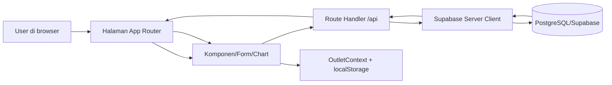
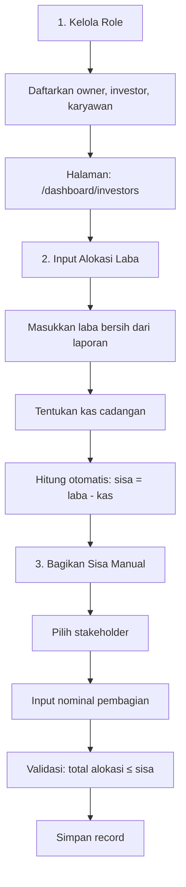
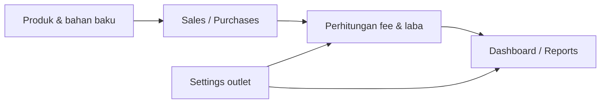
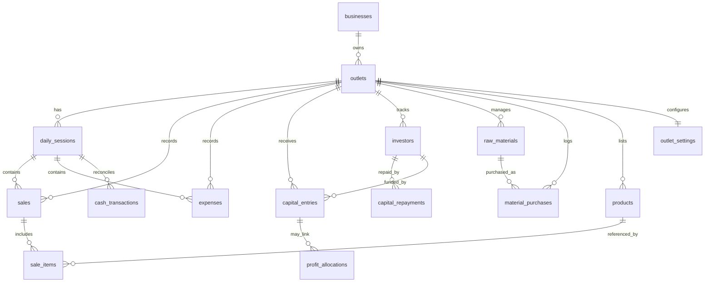

# Financial Management & Reporting System for Roti Bakar Usaha

Sistem manajemen keuangan dan pelaporan yang komprehensif untuk usaha roti bakar (makanan kaki lima Indonesia).

## Ringkasan Arsitektur

- **Framework**: Next.js App Router dengan route handler di `src/app/api/**`.
- **Data Layer**: Supabase PostgreSQL dengan akses server-side lewat `src/lib/supabase/server.ts`.
- **Multi-outlet**: Semua fitur inti mengikuti `outlet_id` aktif, bukan lagi fallback demo.
- **State Aplikasi**: Outlet aktif dipilih lewat `OutletContext` dan selector di header.
- **Prinsip Data**: Halaman sesi, dashboard, settings, investor, dan admin memakai data real dari API/DB.

## Perubahan Terbaru

- **Sesi Harian**: Detail sesi sekarang ambil data real, bukan mock; tombol tutup sesi memanggil `PATCH /api/sessions/{id}`.
- **Duplicate Guard**: `POST /api/sessions` menolak sesi open ganda untuk outlet yang sama.
- **Dashboard**: Perhitungan `net revenue`, `top products`, dan `weekly profit` sudah dibenarkan.
- **Outlet Context**: Hardcoded demo outlet dihapus dan diganti selector outlet dari API.
- **Settings**: Halaman pengaturan sekarang simpan dan baca data dari API/DB lewat `outlet_settings`.
- **Cleanup**: Beberapa fallback demo dan nilai dummy yang bisa mengubah data sudah dibersihkan.
- **Sistem Alokasi Dana (Refactor)**: Alur baru untuk pembagian laba yang lebih manual dan transparan:
  - **Kelola Role**: Halaman terpisah untuk mendaftar owner, investor, dan karyawan (tanpa share %).
  - **Alokasi Laba Manual**: Masukkan laba bersih, potong kas operasional, lalu bagikan sisa secara nominal ke stakeholder terpilih.
  - **Hapus Rule-based Allocation**: Menghilangkan kompleksitas otomatis; pembagian sepenuhnya berdasarkan input manual per periode.

### 📌 REFACTOR FUNDING SOURCE & EXPENSE SIMPLIFICATION (2026-06-07)

Sistem kini memiliki arsitektur keuangan yang lebih jelas dengan tracking per-transaksi:

**Perubahan Utama:**
- **Funding Source Tracking**: Setiap pengeluaran sekarang terbagi antara "Dari Kas" (penjualan) vs "Dari Modal" (investor injection)
- **Expense Categories Simplified**: Dari 5 kategori → 3 kategori inti (Bahan, Operasional, Peralatan) untuk menghilangkan ambiguitas
- **Smart Cicil/Lunas Repayment**: Pengembalian modal bisa full (lunas) atau partial (cicil) dengan tracking sisa yang pending
- **OPSI A Profit Model**: **Profit = Penjualan - Operasional ONLY** (Bahan & Peralatan = ASSETS di balance sheet, bukan expense)

**Settlement Priority (Fixed Order):**
1. Operating Expenses (dari kas penjualan)
2. Modal Repayment (partial/full dengan cicil/lunas)
3. Reserve Kas (untuk operasional bulan depan)
4. Profit Sharing (hanya jika modal 100% sudah kembali)

**Detail Implementasi & Migrasi:** Lihat [REFACTOR_FUNDING_EXPENSES_PLAN.md](REFACTOR_FUNDING_EXPENSES_PLAN.md) untuk dokumentasi lengkap tentang database changes, API validation, form updates, dan testing guide.

## ✅ Status Implementasi Saat Ini

### Fitur yang SUDAH Selesai & Teruji
- ✅ Multi-outlet support dengan selector outlet
- ✅ Daily session management (buka/tutup sesi)
- ✅ Sales entry dengan 3 channel (Offline/ShopeeFood/GoFood)
- ✅ Auto-kalkulasi platform fee per channel
- ✅ Payment methods: Cash, QRIS, Split
- ✅ Expense entry dengan 3 kategori (Bahan/Operasional/Peralatan)
- ✅ Funding source tracking (Dari Kas / Dari Modal)
- ✅ Investor management dengan source_type (owner/investor/karyawan)
- ✅ Cicil vs Lunas repayment dengan smart guidance
- ✅ Product master dengan channel-specific pricing
- ✅ Dashboard metrics dengan cash flow breakdown
- ✅ Reports & Excel export
- ✅ Allocation & profit sharing
- ✅ Material purchases & supplier tracking
- ✅ TypeScript interfaces updated dengan funding source fields
- ✅ API validation untuk category, funding_source, investor_id

### Fitur Pending Testing
- ⏳ End-to-end testing dengan real business data (akan test saat live)
- ⏳ Database migrations execution di Supabase (manual run required)
- ⏳ Cross-tab data correlation verification
- ⏳ Settlement workflow full validation

### Catatan Penting
- 📌 **No Data Loss Risk**: Refactor bersifat additive (hanya tambah columns, tidak hapus)
- 📌 **Demo Data**: Seed data masih ada untuk development, akan di-cleanup sebelum production
- 📌 **RLS Status**: Masih permissive (demo mode), perlu hardening untuk production
- 📌 **Auth Status**: Belum implementasi (stub only), bisa ditambah kemudian

---

- **Database Migrations**: Jalankan migration-funding-source-tracking.sql untuk menambah columns `funding_source`, `funded_by_investor_id`, `repayment_type`, dan `remaining_modal` yang diperlukan untuk refactor terbaru
- **Audit Lanjutan**: Cari sisa mock/dummy yang belum berdampak langsung ke laporan atau transaksi.
- **Multi-outlet Report**: Tambahkan ringkasan lintas outlet dan filter agregasi yang lebih jelas.
- **UX Mobile**: Rapikan selector outlet dan navigasi di layar kecil.
- **Security**: Ganti setup demo permissive ke RLS berbasis user/outlet untuk production.

## Peta Modul

- **`src/app/(auth)`**: Alur login dan layout autentikasi (stub for future auth expansion)
- **`src/app/dashboard`**: Halaman operasional (dashboard, sessions, sales, expenses, capital, funding/investors, products, materials, sourcing, suppliers, reports, settings)
- **`src/app/api`**: Backend routes untuk semua operasi CRUD dan kalkulasi bisnis
- **`src/components`**: Reusable UI components (forms, tables, charts, layout, modals, ui)
  - **forms/**: ExpenseForm, SaleForm, SessionForm, etc.
  - **tables/**: SalesTable, ExpensesTable, InvestorsTable, etc.
  - **charts/**: DailyProfitChart, RevenueByChannelChart, PaymentMethodChart, TopProductsChart
  - **layout/**: Header, Sidebar, OutletContext Provider
  - **modals/**: Modal dialogs untuk create/edit/delete
  - **ui/**: shadcn components (Button, Card, Dialog, Select, etc.)
- **`src/lib`**: Business logic & utilities
  - **supabase/**: Server & client Supabase clients dengan RLS context
  - **calculations/**: Platform fee calculation, profit calculation
  - **allocation/**: Profit allocation engine & logic
  - **cash/**: Cash ledger & reconciliation
  - **context/**: OutletContext untuk outlet selector & session management
  - **export/**: Excel export utility untuk reports
  - **utils.ts**: Formatter & helper functions
- **`database/` & `migrations/`**: SQL schema, migrations, seed data
  - Initial schema: businesses, outlets, products, etc.
  - Migration files: funding-source-tracking, session-status, outlet-settings, etc.
  - Seed files: Demo data untuk development
- **`types/`**: TypeScript interfaces untuk database models & UI forms

## Alur Data



## Mapping Endpoint ke DB

| Endpoint | Tujuan | Tabel utama |
| --- | --- | --- |
| `/api/sessions` | List / create sesi | `daily_sessions` |
| `/api/sessions/[id]` | Close / delete sesi | `daily_sessions` |
| `/api/sales` | List / create penjualan | `sales`, `sale_items`, `products` |
| `/api/expenses` | List / create pengeluaran | `expenses` |
| `/api/capital` | List / create modal | `capital_entries` |
| `/api/investors` | CRUD investor | `investors`, `capital_repayments` |
| `/api/materials` | Master bahan baku | `raw_materials` |
| `/api/material-purchases` | Pembelian bahan | `material_purchases` |
| `/api/products` | Master produk | `products` |
| `/api/dashboard` | Ringkasan metrik | `sales`, `expenses`, `sale_items`, `daily_sessions` |
| `/api/reports/summary` | Laporan P&L | `sales`, `expenses`, `sale_items`, `daily_sessions` |
| `/api/settings` | Simpan pengaturan outlet | `outlet_settings` |
| `/api/outlets` | Daftar outlet aktif | `outlets`, `businesses` |

## Alur Fitur Utama

### Alokasi Dana & Pembagian Laba (Alur Baru - Manual & Transparan)



**Langkah-langkah:**

1. **Kelola Role** (`/dashboard/investors`):
   - Tambah nama dengan tipe: Owner, Investor, atau Karyawan
   - Simpan nomor HP dan catatan (opsional)
   - Tidak ada input share % (hanya nominal saat alokasi)

2. **Alokasi Laba** (`/dashboard/funding`, tab "Alokasi Laba"):
   - Input **Laba Bersih** dari laporan penjualan
   - Input **Kas Cadangan** untuk operasional (nominal langsung)
   - Sistem hitung: `sisa_alokasi = laba_bersih - kas_cadangan`
   - Bagikan sisa ke stakeholder yang sudah terdaftar (entry per orang, nominal per entry)
   - Validasi: total alokasi tidak boleh melebihi sisa
   - Catatan alokasi tersimpan untuk audit trail

3. **Keuntungan Model Baru**:
   - ✓ Lebih transparan: semua angka terlihat jelas
   - ✓ Lebih fleksibel: bisa disesuaikan per periode tanpa setup rule
   - ✓ Lebih manual: kontrol penuh kepada pengguna
   - ✓ Lebih sederhana: tanpa kalkulasi persen otomatis

### Alur Original (Disimpan untuk Referensi)



## Skema Inti

| Tabel | Peran | Relasi penting |
| --- | --- | --- |
| `businesses` | Identitas usaha (holding) | Induk dari `outlets` |
| `outlets` | Cabang/gerai aktif | Foreign key di semua transaksi & master data |
| `daily_sessions` | Wadah transaksi harian | Parent untuk `sales` dan `expenses` |
| `sales` | Header penjualan | Parent untuk `sale_items`, refer ke `daily_sessions` & `outlets` |
| `sale_items` | Detail item per penjualan | Refer ke `sales` dan `products` |
| `expenses` | Pengeluaran operasional & asset | Refer ke `daily_sessions`, `outlets`, dan opsional `investors` (jika funding_source='modal') |
| `capital_entries` | Catatan modal masuk | Refer ke `outlets` dan opsional `investors` |
| `capital_repayments` | Riwayat pengembalian modal | Refer ke `investors`, track `repayment_type` (lunas/cicil) & `remaining_modal` |
| `investors` | Data pemberi modal | Refer ke `outlets`, punya `source_type` (owner/investor/karyawan) |
| `products` | Master produk jualan | Refer ke `outlets`, punya channel-specific pricing (offline/shopeefood/gofood) |
| `raw_materials` | Master bahan baku | Refer ke `outlets` |
| `material_purchases` | Pembelian bahan baku | Refer ke `outlets`, `raw_materials`, opsional `suppliers` |
| `suppliers` | Master supplier bahan | Refer ke `outlets` |
| `supplier_prices` | Harga per supplier-bahan | Refer ke `suppliers` & `raw_materials` |
| `stakeholders` | Penerima alokasi laba | Refer ke `outlets` dan opsional `investors` |
| `allocation_rules` | Aturan pembagian laba | Refer ke `outlets` |
| `profit_allocations` | Record alokasi laba per periode | Refer ke `outlets` |
| `allocation_runs` | Eksekusi alokasi (dry/executed) | Refer ke `outlets` dan `allocation_rules` |
| `allocation_items` | Detail per stakeholder per alokasi | Refer ke `allocation_runs` dan `stakeholders` |
| `cash_transactions` | Ledger mutasi kas untuk audit trail | Refer ke `outlets` dan source transaksi |
| `outlet_settings` | Konfigurasi per outlet | Unique per `outlet_id` |

## Model Funding dan Alokasi Hasil

Model yang digunakan di sistem ini memisahkan dua konsep utama:

- **Sumber modal** (`investors` / owner) adalah data yang merekam siapa yang menaruh modal.
- **Stakeholder** adalah data penerima alokasi laba, yang bisa berhubungan dengan sumber modal atau berdiri sendiri.

Alur ideal:
1. `capital_entries` mencatat modal masuk nyata.
2. `capital_repayments` mencatat modal yang dikembalikan.
3. `allocation_rules` menentukan apakah modal dikembalikan dulu (`recover_first`) dan berapa yang disisihkan untuk kas.
4. `stakeholders` menentukan siapa yang mendapat bagian laba dan berapa `share_percent` mereka.
5. Sisa laba setelah recover modal dan reserve kas dibagi menurut `share_percent` stakeholder.

### Role dan relasi stakeholder

- `owner` / `investor`: pilih dari sumber modal yang sudah terdaftar.
- `karyawan` / `other`: dapat diinput secara manual dan tidak perlu terhubung ke sumber modal.

### Prinsip penting

- `share_percent` hanya untuk pembagian laba, bukan untuk mencatat modal.
- `kas reserve` dipotong sebelum pembagian laba dan bisa ditentukan secara fleksibel per periode.
- `recover_first` memastikan modal yang belum kembali dibayar sebelum hasil dibagi.

## Diagram Relasi Tabel



## 📋 Daftar Endpoint Lengkap

### Operasional Inti

| Endpoint | Metode | Fungsi | Tabel utama | Catatan |
| --- | --- | --- | --- | --- |
| `/api/sessions` | `GET`, `POST` | Daftar dan buat sesi | `daily_sessions` | ✅ Sesuai |
| `/api/sessions/[id]` | `PATCH`, `DELETE` | Tutup atau hapus sesi | `daily_sessions` | ✅ Sesuai |
| `/api/sales` | `GET`, `POST` | Daftar dan buat penjualan | `sales`, `sale_items` | ✅ Sesuai |
| `/api/sales/[id]` | `PATCH`, `DELETE` | Edit atau hapus penjualan | `sales`, `sale_items` | ✅ Sesuai (+ cash_transactions) |
| `/api/expenses` | `GET`, `POST` | Daftar dan buat pengeluaran | `expenses` | ✅ Sesuai (+ cash_transactions) |
| `/api/expenses/[id]` | `PATCH`, `DELETE` | Edit atau hapus pengeluaran | `expenses` | ✅ Sesuai (+ cash_transactions) |
| `/api/capital` | `GET`, `POST` | Daftar dan buat modal | `capital_entries` | ✅ Sesuai (+ cash_transactions) |
| `/api/capital/[id]` | `PATCH` | Edit modal dengan audit trail | `capital_entries` | ⚠️ HANYA PATCH (bukan DELETE) |
| `/api/dashboard` | `GET` | Ringkasan metrik utama | `sales`, `expenses`, `sale_items`, `daily_sessions` | ✅ Sesuai |
| `/api/dashboard/expenses-details` | `GET` | Detail pengeluaran per kategori | `expenses` | ✨ NEW (tambahan detail endpoint) |
| `/api/reports/summary` | `GET` | Laporan P&L dan ringkasan | `sales`, `expenses`, `sale_items`, `daily_sessions` | ✅ Sesuai |
| `/api/reports/export` | `GET` | Export Excel laporan | gabungan query laporan | ✅ Sesuai |
| `/api/cash/balance` | `GET` | Hitung cash balance & validasi | `cash_transactions` | ✨ NEW (utility endpoint) |

### Produk, Bahan, dan Sourcing

| Endpoint | Metode | Fungsi | Tabel utama | Catatan |
| --- | --- | --- | --- | --- |
| `/api/products` | `GET`, `POST` | Master produk | `products` | ✅ Sesuai |
| `/api/products/[id]` | ~~`PATCH`~~, `DELETE` | Edit atau hapus produk | `products` | ⚠️ DELETE only (bukan PATCH) |
| `/api/raw-materials` | `GET`, `POST` | Master bahan baku | `raw_materials` | ✅ Sesuai |
| `/api/raw-materials/[id]` | ~~`PATCH`~~, `DELETE` | Edit atau hapus bahan baku | `raw_materials` | ⚠️ DELETE only (bukan PATCH) |
| `/api/material-purchases` | `GET`, `POST` | Catatan pembelian bahan | `material_purchases` | ✅ Sesuai (merged into expenses) |
| `/api/material-purchases/[id]` | `DELETE` | Hapus pembelian bahan | `material_purchases` | ⚠️ DELETE only |
| `/api/materials/purchases` | `GET`, `POST` | Alias riwayat pembelian bahan | `material_purchases` | ✅ Sesuai (alternative endpoint) |
| `/api/suppliers` | `GET`, `POST` | Master supplier | `suppliers` | ✅ Sesuai |
| `/api/suppliers/[id]` | `DELETE` | Hapus supplier | `suppliers` | ⚠️ DELETE only (bukan PATCH) |
| `/api/supplier-prices` | `GET`, `POST` | Harga supplier / perbandingan | `supplier_prices` | ✅ Sesuai |

### Investor, Alokasi, dan Administrasi

| Endpoint | Metode | Fungsi | Tabel utama | Catatan |
| --- | --- | --- | --- | --- |
| `/api/investors` | `GET`, `POST` | Master investor | `investors` | ✅ Sesuai |
| `/api/investors/[id]` | `DELETE` | Hapus investor | `investors` | ⚠️ DELETE only (bukan PATCH) |
| `/api/capital-repayments` | `GET`, `POST` | Riwayat pengembalian modal | `capital_repayments` | ✅ Sesuai (+ cash_transactions, investors) |
| `/api/capital-repayments/[id]` | `DELETE` | Hapus repayment | `capital_repayments` | ⚠️ DELETE only (bukan PATCH) |
| `/api/allocations` | `GET`, `POST` | Rekap alokasi laba | `allocation_runs` | ✅ Sesuai (executes/previews allocations) |
| `/api/allocations/[id]` | `GET`, `DELETE` | Lihat atau hapus alokasi | `allocation_runs`, `allocation_items` | ⚠️ GET + DELETE (bukan PATCH) |
| `/api/allocation-rules` | `GET`, `POST` | Aturan pembagian laba | `allocation_rules` | ✅ Sesuai |
| `/api/allocation-rules/[id]` | `PUT`, `DELETE` | Update atau hapus aturan | `allocation_rules` | ⚠️ PUT instead of PATCH |
| `/api/profit-allocations` | `GET`, `POST` | Detail alokasi laba | `profit_allocations` | ✅ Sesuai |
| `/api/profit-allocations/[id]` | `DELETE` | Hapus detail alokasi | `profit_allocations` | ⚠️ DELETE only (bukan PATCH) |
| `/api/stakeholders` | `GET`, `POST` | Data stakeholder | `stakeholders` | ✅ Sesuai |
| `/api/stakeholders/[id]` | `PUT`, `DELETE` | Update atau hapus stakeholder | `stakeholders` | ⚠️ PUT instead of PATCH |
| `/api/cash-transactions` | `GET`, `POST` | Mutasi kas | `cash_transactions` | ✅ Sesuai (ledger audit trail) |
| `/api/cash-transactions/[id]` | `DELETE` | Hapus transaksi kas | `cash_transactions` | ⚠️ DELETE only (bukan PATCH) |
| `/api/admin/clear-data` | `POST` | Hapus data outlet (QA mode) | banyak tabel | ✅ Sesuai (safe mode - hanya hari ini) |

### Konfigurasi dan Referensi

| Endpoint | Metode | Fungsi | Tabel utama | Catatan |
| --- | --- | --- | --- | --- |
| `/api/settings` | `GET`, `PUT` | Baca/simpan setting outlet | `outlet_settings` | ✅ Sesuai |
| `/api/outlets` | `GET` | Daftar outlet aktif | `outlets`, `businesses` | ✅ Sesuai |

---

## 📋 API Audit & Corrections (2026-06-07)

Komprehensif audit endpoint API dilakukan untuk memastikan akurasi dokumentasi. Berikut adalah temuan perubahan dan klarifikasi:

### Summary Audit
- **Total Endpoints**: 39 routes aktif
- **Endpoint yang Sesuai**: 22 ✅
- **Endpoint dengan Perbedaan Metode**: 7 ⚠️
- **Endpoint Baru (tidak di-list)**: 2 ✨

### Perubahan yang Ditemukan

#### A. Method Changes (Perubahan Metode HTTP)

**Dari README → Actual API:**

| Endpoint | Dokumentasi | Aktual | Perubahan |
| --- | --- | --- | --- |
| `/api/products/[id]` | PATCH, DELETE | DELETE | ❌ PATCH dihapus |
| `/api/raw-materials/[id]` | PATCH, DELETE | DELETE | ❌ PATCH dihapus |
| `/api/suppliers/[id]` | PATCH, DELETE | DELETE | ❌ PATCH dihapus |
| `/api/investors/[id]` | PATCH, DELETE | DELETE | ❌ PATCH dihapus |
| `/api/capital-repayments/[id]` | PATCH, DELETE | DELETE | ❌ PATCH dihapus |
| `/api/profit-allocations/[id]` | PATCH, DELETE | DELETE | ❌ PATCH dihapus |
| `/api/cash-transactions/[id]` | PATCH, DELETE | DELETE | ❌ PATCH dihapus |
| `/api/allocations/[id]` | PATCH, DELETE | GET, DELETE | ⚠️ GET bukan PATCH |
| `/api/allocation-rules/[id]` | PATCH, DELETE | PUT, DELETE | ⚠️ PUT bukan PATCH |
| `/api/stakeholders/[id]` | PATCH, DELETE | PUT, DELETE | ⚠️ PUT bukan PATCH |

**Analisis:** Banyak endpoint yang hanya support DELETE (tidak ada update via PATCH/PUT), kecuali untuk allocation-rules dan stakeholders yang menggunakan PUT.

#### B. New Endpoints (Endpoint Baru/Tambahan)

**Endpoints yang tidak di-list di README:**

1. **`/api/cash/balance`** (GET)
   - **Fungsi**: Calculate current cash balance dari cash_transactions
   - **Tabel**: `cash_transactions`
   - **Use Case**: Validate expense amounts against available cash

2. **`/api/dashboard/expenses-details`** (GET)
   - **Fungsi**: Get expense details for specific category and date
   - **Tabel**: `expenses`
   - **Use Case**: Detailed breakdown untuk specific kategori

#### C. Tabel Tambahan pada Endpoint

Beberapa endpoint berinteraksi dengan lebih banyak tabel dari yang didokumentasikan:

| Endpoint | Documented | Actual Additional Tables |
| --- | --- | --- |
| `/api/sales/[id]` | sales, sale_items | + cash_transactions |
| `/api/expenses/[id]` | expenses | + cash_transactions |
| `/api/capital/[id]` | capital_entries | + cash_transactions |
| `/api/capital` | capital_entries | + cash_transactions |
| `/api/capital-repayments` | capital_repayments | + cash_transactions, investors |
| `/api/allocations` | allocation_runs | + allocation_rules |

**Reason**: Semua transaksi finansial auto-record ke cash_transactions untuk audit trail.

---

### Rekomendasi Implementasi

✅ **Current Approach (Recommended)**:
- Dokumentasi di README tetap sebagai high-level reference
- Actual method specifics bisa berbeda per endpoint
- Details check langsung di source code route handlers
- Audit ini capture discrepancies untuk future reference

⚠️ **Future Improvements**:
- Buat OpenAPI/Swagger spec untuk automated documentation
- Add TypeScript route type definitions untuk consistency
- Implement PATCH handlers untuk endpoints yang hanya DELETE

---

### Catatan Penting untuk Development

1. **DELETE-Only Endpoints**: Banyak endpoints master (products, suppliers, investors, dll) hanya support DELETE, tidak ada PATCH/PUT. Jika perlu update, gunakan POST/update logic atau akses langsung ke database.

2. **PUT vs PATCH**: 
   - `allocation-rules/[id]` & `stakeholders/[id]` menggunakan **PUT** (bukan PATCH)
   - Pastikan client send full object saat update

3. **Cash Transactions**: Semua financial endpoints auto-create cash_transactions entries untuk ledger audit trail. Jangan manual create `cash_transactions` records.

4. **Table Relationships**: Beberapa endpoint (allocations, capital-repayments) berinteraksi dengan multiple tables. Check return types untuk full data structure.

---

Sistem terbagi menjadi beberapa halaman operasional di `/app/dashboard/`:

### **Dashboard** (`/dashboard/dashboard`)
- **Metrik Inti**: Pendapatan kotor, pendapatan bersih (setelah platform fee), laba, pengeluaran
- **Breakdown Kategori**: Pengeluaran terbagi 3 kategori (Bahan, Operasional, Peralatan)
- **Cash Flow Tracking**: Kas dari modal vs kas dari penjualan
- **Grafik Visualisasi**:
  - Pendapatan per channel (Offline/ShopeeFood/GoFood)
  - Metode pembayaran (Cash/QRIS)
  - Produk paling terjual
  - Trend laba harian
- **Real-time Updates**: Metrik otomatis update dari database real

### **Manajemen Sesi** (`/dashboard/sessions`)
- Buka sesi harian dengan modal awal (opening cash)
- Sesi adalah container untuk semua transaksi hari itu
- Tutup sesi dengan verifikasi cash balance dan closing cash
- Riwayat sesi lengkap dengan ringkasan penjualan & pengeluaran per sesi
- Guard: Tidak bisa buka 2 sesi untuk outlet yang sama di hari yang sama

### **Penjualan** (`/dashboard/sales`)
- Input penjualan dengan 3 channel: **Offline** (0% fee), **ShopeeFood** (20% fee), **GoFood** (25% fee)
- Metode pembayaran: Cash, QRIS, Split (cash + QRIS)
- Fitur split payment: Pisah pembayaran antara cash dan QRIS
- Auto-kalkulasi: Gross amount → Platform fee → Net amount
- Order reference tracking (untuk online channels)
- Multi-item per transaksi (item + qty + price)
- Catatan per transaksi

### **Pengeluaran** (`/dashboard/expenses`)
- **Kategori (3 only)**:
  - **Bahan**: Inventory asset (tidak langsung mengurangi profit)
  - **Operasional**: Biaya rutin harian (langsung mengurangi profit per OPSI A)
  - **Peralatan**: Inventory asset (tidak langsung mengurangi profit)
- **Funding Source Tracking**:
  - "Dari Kas": Bayar dari penjualan revenue
  - "Dari Modal": Bayar dari investor injection (require select investor)
- Pencatatan dengan deskripsi, jumlah, tanggal
- Analisis per kategori & per sumber dana
- **⚠️ Akuntansi OPSI A**: Hanya Operasional yang mengurangi profit; Bahan & Peralatan = Balance Sheet ASSETS

### **Modal Usaha** (`/dashboard/capital`)
- Pencatatan entri modal dari berbagai sumber
- Link ke investor (optional, jika dari specific investor)
- Tracking source_type (owner vs investor vs karyawan)
- Total modal terakumulasi per outlet
- Riwayat lengkap dengan tanggal, amount, sumber

### **Manajemen Investor / Sumber Dana** (`/dashboard/investors`)
- **Kelola Sumber Dana**: Daftarkan owner, investor, dan karyawan
- **Source Type**: Distinguish antara owner (pemilik usaha), investor (pemberi modal), karyawan (anggota tim)
- **Initial Contribution**: Catat berapa banyak modal awal setiap sumber
- **Tracking Manual**: Remaining balance otomatis update saat ada repayment
- **Status**: active, partial, settled
- **Priority Order**: Urutan prioritas pengembalian modal

### **Pembayaran Modal / Alokasi Laba** (`/dashboard/funding`)
Halaman multi-tab untuk manajemen funding:

**Tab 1: Kelola Role**
- Daftar dan edit data owner/investor/karyawan
- Tambah, edit, hapus funding source
- View investor contribution amount & remaining balance

**Tab 2: Modal (Capital)**
- Entry modal masuk dari investor/owner
- Link ke specific investor
- Pencatatan tanggal & amount
- Riwayat lengkap modal per outlet

**Tab 3: Alokasi Laba (Profit Allocation)**
- **Profit Calculation**: Auto-calculate dari metrics
  - Formula: **Profit = Penjualan - Operasional ONLY** (OPSI A)
  - Bahan & Peralatan tidak dihitung sebagai expense
- **Settlement Priority** (Fixed Order):
  1. Operating Expenses (bayar dari kas penjualan)
  2. Modal Repayment (partial/full dengan cicil/lunas)
  3. Reserve Kas (untuk operasional bulan depan)
  4. Profit Sharing (hanya setelah modal 100% kembali)
- Manual input untuk kas cadangan & alokasi nominal per stakeholder
- Verifikasi: Total alokasi tidak boleh melebihi available profit

**Tab 4: Pembayaran Balik Modal (Modal Repayment)**
- Dropdown investor dengan capital amount
- **Cicil vs Lunas Smart Guidance**:
  - If available cash ≥ total pending modal: Suggest LUNAS (full repayment)
  - If available cash < total pending modal: Suggest CICIL (partial repayment)
- **Lunas** (Full): Repay seluruh sisa modal sekaligus
- **Cicil** (Partial):
  - Input jumlah bayar kali ini
  - System track remaining_modal untuk pembayaran periode berikutnya
  - Catatan untuk audit trail
- Repayment history dengan type indicator (✅ Lunas / 📅 Cicil)
- Auto-update investor remaining_balance

### **Produk Master** (`/dashboard/products`)
- Manajemen daftar produk dengan 3 channel-specific pricing:
  - Price Offline
  - Price ShopeeFood
  - Price GoFood
- Status aktif/nonaktif per produk
- Deskripsi & kategori produk
- Delete dan edit functionality

### **Bahan & Sourcing** (`/dashboard/materials`, `/dashboard/sourcing`)
- **Raw Materials Master**: Daftar bahan baku dengan unit (kg, pcs, dll)
- **Suppliers Master**: Daftarkan supplier dengan contact, rating, reliability
- **Supplier Prices**: Track harga per supplier per bahan (untuk comparison & negotiation)
- **Material Purchases**: Catatan pembelian bahan dengan quantity, unit price, total
  - Link ke session (optional)
  - Link ke supplier
  - Invoice number, payment status, delivery date
  - Quality notes (Baik/Kurang/Rusak)

### **Laporan Keuangan** (`/dashboard/reports`)
- **Laporan P&L (Profit & Loss)**:
  - Gross Revenue, Platform Fees, Net Revenue
  - Operating Expenses, Inventory/Asset Purchases
  - Profit Margin %
  - Expense breakdown by category
- **Export Excel**: Multi-sheet format dengan summary & detail
- **Filter Periode**: Custom date range
- **Analisis**: Trend & comparison per channel

### **Pengaturan** (`/dashboard/settings`)
- Setting per outlet (e.g., default opening cash, reserve percentage)
- Save & read dari API `/api/settings`
- Persisten per outlet_id

## 🔄 Alur Operasional yang Disarankan (Daily)

### **Pagi - Buka Sesi**
1. Buka halaman `/dashboard/sessions`
2. Klik "Buat Sesi Baru"
3. Input opening cash (modal awal hari ini)
4. Sesi sekarang siap menerima transaksi

### **Siang/Sore - Catat Transaksi**

**Input Penjualan:**
1. Buka `/dashboard/sales`
2. Catat setiap transaksi terjual:
   - Pilih channel (Offline/ShopeeFood/GoFood)
   - Pilih produk & qty
   - Sistem auto-hitung platform fee & net amount
   - Pilih payment method (Cash/QRIS/Split)
3. Sistem auto-hitung profit per channel

**Input Pengeluaran:**
1. Buka `/dashboard/expenses`
2. Catat setiap pengeluaran:
   - Pilih kategori (Bahan/Operasional/Peralatan)
   - Input deskripsi (e.g., "Beras 10kg", "Gas", "Panci baru")
   - Input jumlah & tanggal
   - Pilih sumber dana:
     - "Dari Kas": Bayar dari revenue penjualan
     - "Dari Modal": Bayar dari investor capital (wajib select investor)
3. Deskripsi mandatory untuk audit trail

**Input Modal (jika ada):**
1. Buka `/dashboard/funding` → Tab 2 (Modal)
2. Catat jika ada investor masuk modal
3. Pilih investor & jumlah modal
4. Sistem track di investor table

### **Malam - Tutup Sesi & Alokasi**

**Tutup Sesi:**
1. Buka `/dashboard/sessions`
2. Cari sesi hari ini → Klik "Tutup Sesi"
3. Input closing cash (uang tunai yang tersisa)
4. Sistem verifikasi: closing_cash ≥ (opening_cash + net penjualan - pengeluaran kas)
5. Sesi closed, transaksi tidak bisa diubah

**Alokasi Laba (jika sudah saatnya / bulanan):**
1. Buka `/dashboard/funding` → Tab 3 (Alokasi Laba)
2. Sistem auto-calculate profit:
   - `Profit = Total Penjualan - Operasional ONLY`
   - Bahan & Peralatan = Balance Sheet Assets (tidak kurang profit)
3. Input kas cadangan (untuk operasional bulan depan)
4. Input alokasi nominal ke setiap owner/investor
5. Verifikasi total alokasi ≤ available profit
6. Simpan record alokasi

**Bayar Kembali Modal (jika ada surplus cash):**
1. Buka `/dashboard/funding` → Tab 4 (Pembayaran)
2. Pilih investor dengan modal pending
3. Smart guidance akan suggest:
   - "Bayar LUNAS" (jika cash cukup untuk semuanya)
   - "Cicil saja" (jika cash terbatas)
4. Pilih metode:
   - **Lunas**: Bayar seluruh sisa modal sekaligus
   - **Cicil**: Bayar sebagian, sisa untuk periode berikutnya
5. Input jumlah & catatan
6. Simpan → Investor remaining_balance auto-update

### **Akhir Bulan - Review & Export**

1. Buka `/dashboard/reports`
2. Set periode filter (bulan ini)
3. Review P&L:
   - Gross revenue vs net revenue (setelah platform fee)
   - Operasional vs Inventory spending
   - Profit margin
4. Export Excel untuk arsip & analisis
5. Share laporan ke investor/owner

---

## 📊 Akuntansi Model (OPSI A - Final)

```
PROFIT CALCULATION:
  Gross Revenue (offline + online)
  - Platform Fees (20% ShopeeFood, 25% GoFood)
  = NET REVENUE
  - Operational Expenses ONLY
  = PROFIT UNTUK DISTRIBUSI
  
TIDAK dikurangi profit:
  × Bahan (inventory asset)
  × Peralatan (inventory asset)
  
SETTLEMENT ORDER (Fixed):
  1. Operating Expenses (pay from sales revenue)
  2. Modal Repayment (lunas atau cicil)
  3. Reserve Kas (next month operational)
  4. Profit Sharing (ke owner/investor) - only if modal 100% returned
```

---

## 💾 Database Structure (Post-Refactor)

### Expense Funding Source Tracking
```sql
expenses table additions:
├─ funding_source: 'kas' | 'modal'
├─ funded_by_investor_id: UUID (null if kas)
└─ (Bahan & Peralatan marked as assets, not immediate expenses)
```

### Capital Repayment Flexibility
```sql
capital_repayments table additions:
├─ repayment_type: 'lunas' | 'cicil'
├─ remaining_modal: DECIMAL (tracking pending amount)
└─ (Track partial repayment for multi-period settlement)
```

### Investor Source Type Distinction
```sql
investors table additions:
├─ source_type: 'owner' | 'investor' | 'karyawan'
└─ notes: TEXT (for context)

## 🛠️ Tech Stack

- **Frontend Framework**: Next.js 16.2.6 (App Router + Turbopack)
- **UI Library**: React 19.2.4
- **Styling**: Tailwind CSS v4 (@tailwindcss/postcss)
- **UI Components**: shadcn/ui (Button, Card, Dialog, Select, Tabs, etc.)
- **Database**: Supabase PostgreSQL
- **Database Client**: @supabase/supabase-js 2.106.1 + @supabase/ssr 0.10.3
- **Data Visualization**: Recharts 3.8.1 (untuk charts & graphs)
- **Excel Export**: SheetJS (xlsx) 0.18.5
- **Icons**: lucide-react 1.16.0
- **Date Utilities**: date-fns 4.2.1
- **Type Safety**: TypeScript 5
- **Code Quality**: ESLint 9

## 📋 Prerequisites

- Node.js 18+ dan npm/yarn
- Akun Supabase (gratis: https://supabase.com)
- Browser modern

## 🚀 Setup & Installation

### 1. Clone Repository
```bash
git clone <repo-url>
cd roti-bakar-finance
```

### 2. Install Dependencies
```bash
npm install
```

### 3. Setup Supabase

#### Buat Project Baru
1. Kunjungi https://supabase.com
2. Sign up atau login
3. Buat project baru
4. Tunggu project selesai

#### Setup Database Schema
1. Di Supabase, buka **SQL Editor**
2. Klik **New Query**
3. Copy-paste script SQL di bawah
4. Klik **Run**
5. ✅ Database siap dengan seed awal untuk outlet, produk, sesi, dan laporan contoh

#### Jalankan Migration Tambahan

Setelah schema utama, jalankan juga file ini agar struktur terbaru sesuai kode:

- `database/migration-session-status.sql` → menambah `closed_at` pada sesi
- `database/migration-outlet-settings.sql` → membuat tabel `outlet_settings`

**Atau untuk investor system saja:**
- File: `database/investor-schema.sql` di root project
- Copy-paste ke Supabase SQL Editor dan Run

#### Ambil API Keys
1. Di Supabase dashboard, klik **Settings** (gear icon)
2. Pilih **API** di sidebar kiri
3. Salin:
   - `Project URL` → `NEXT_PUBLIC_SUPABASE_URL`
   - `anon public` → `NEXT_PUBLIC_SUPABASE_ANON_KEY`
   - `service_role secret` → `SUPABASE_SERVICE_ROLE_KEY` (optional untuk demo)
```sql
-- ========================================
-- DEMO SETUP: All tables with permissive RLS
-- ========================================

-- Businesses table
CREATE TABLE IF NOT EXISTS businesses (
  id UUID PRIMARY KEY DEFAULT uuid_generate_v4(),
  name VARCHAR(255) NOT NULL,
  owner_name VARCHAR(255),
  email VARCHAR(255) NOT NULL,
  phone VARCHAR(20),
  address TEXT,
  created_at TIMESTAMP DEFAULT NOW(),
  updated_at TIMESTAMP DEFAULT NOW()
);

-- Outlets table
CREATE TABLE IF NOT EXISTS outlets (
  id UUID PRIMARY KEY DEFAULT uuid_generate_v4(),
  business_id UUID NOT NULL REFERENCES businesses(id) ON DELETE CASCADE,
  name VARCHAR(255) NOT NULL,
  location VARCHAR(255),
  opening_hours VARCHAR(100),
  created_at TIMESTAMP DEFAULT NOW()
);

-- Products table
CREATE TABLE IF NOT EXISTS products (
  id UUID PRIMARY KEY DEFAULT uuid_generate_v4(),
  outlet_id UUID NOT NULL REFERENCES outlets(id) ON DELETE CASCADE,
  name VARCHAR(255) NOT NULL,
  price DECIMAL(10, 2) NOT NULL,
  description TEXT,
  is_active BOOLEAN DEFAULT true,
  created_at TIMESTAMP DEFAULT NOW()
);

-- Raw materials table
CREATE TABLE IF NOT EXISTS raw_materials (
  id UUID PRIMARY KEY DEFAULT uuid_generate_v4(),
  outlet_id UUID NOT NULL REFERENCES outlets(id) ON DELETE CASCADE,
  name VARCHAR(255) NOT NULL,
  unit VARCHAR(50),
  current_stock DECIMAL(10, 2) DEFAULT 0,
  reorder_level DECIMAL(10, 2),
  created_at TIMESTAMP DEFAULT NOW()
);

-- Investors table (untuk tracking pemberi modal)
CREATE TABLE IF NOT EXISTS investors (
  id UUID PRIMARY KEY DEFAULT uuid_generate_v4(),
  outlet_id UUID NOT NULL REFERENCES outlets(id) ON DELETE CASCADE,
  name VARCHAR(255) NOT NULL,
  phone VARCHAR(20),
  initial_contribution DECIMAL(15, 2) NOT NULL,
  remaining_balance DECIMAL(15, 2) NOT NULL,
  status VARCHAR(50) DEFAULT 'active',
  priority_order INT,
  created_at TIMESTAMP DEFAULT NOW()
);

-- Capital entries table (modified untuk link ke investor)
CREATE TABLE IF NOT EXISTS capital_entries (
  id UUID PRIMARY KEY DEFAULT uuid_generate_v4(),
  outlet_id UUID NOT NULL REFERENCES outlets(id) ON DELETE CASCADE,
  date DATE NOT NULL,
  amount DECIMAL(15, 2) NOT NULL,
  source VARCHAR(255),
  source_type VARCHAR(50),
  investor_id UUID REFERENCES investors(id) ON DELETE SET NULL,
  notes TEXT,
  created_at TIMESTAMP DEFAULT NOW()
);

-- Capital repayments table (track pengembalian modal)
CREATE TABLE IF NOT EXISTS capital_repayments (
  id UUID PRIMARY KEY DEFAULT uuid_generate_v4(),
  investor_id UUID NOT NULL REFERENCES investors(id) ON DELETE CASCADE,
  amount DECIMAL(15, 2) NOT NULL,
  repayment_date DATE NOT NULL,
  method VARCHAR(50),
  notes TEXT,
  created_at TIMESTAMP DEFAULT NOW()
);

-- Daily sessions table
CREATE TABLE IF NOT EXISTS daily_sessions (
  id UUID PRIMARY KEY DEFAULT uuid_generate_v4(),
  outlet_id UUID NOT NULL REFERENCES outlets(id) ON DELETE CASCADE,
  date DATE NOT NULL,
  opening_cash DECIMAL(15, 2) NOT NULL,
  closing_cash DECIMAL(15, 2),
  status VARCHAR(20) DEFAULT 'open',
  notes TEXT,
  created_at TIMESTAMP DEFAULT NOW()
);

-- Sales table
CREATE TABLE IF NOT EXISTS sales (
  id UUID PRIMARY KEY DEFAULT uuid_generate_v4(),
  session_id UUID NOT NULL REFERENCES daily_sessions(id) ON DELETE CASCADE,
  outlet_id UUID NOT NULL REFERENCES outlets(id) ON DELETE CASCADE,
  date DATE DEFAULT NOW(),
  channel VARCHAR(50) NOT NULL,
  payment_method VARCHAR(50) NOT NULL,
  gross_amount DECIMAL(15, 2) NOT NULL,
  platform_fee DECIMAL(15, 2) DEFAULT 0,
  net_amount DECIMAL(15, 2) NOT NULL,
  order_ref VARCHAR(100),
  notes TEXT,
  created_at TIMESTAMP DEFAULT NOW()
);

-- Sale items table
CREATE TABLE IF NOT EXISTS sale_items (
  id UUID PRIMARY KEY DEFAULT uuid_generate_v4(),
  sale_id UUID NOT NULL REFERENCES sales(id) ON DELETE CASCADE,
  product_id UUID REFERENCES products(id) ON DELETE SET NULL,
  quantity DECIMAL(10, 2) NOT NULL,
  unit_price DECIMAL(15, 2) NOT NULL,
  subtotal DECIMAL(15, 2) NOT NULL,
  created_at TIMESTAMP DEFAULT NOW()
);

-- Expenses table
CREATE TABLE IF NOT EXISTS expenses (
  id UUID PRIMARY KEY DEFAULT uuid_generate_v4(),
  session_id UUID NOT NULL REFERENCES daily_sessions(id) ON DELETE CASCADE,
  outlet_id UUID NOT NULL REFERENCES outlets(id) ON DELETE CASCADE,
  date DATE NOT NULL,
  category VARCHAR(50) NOT NULL,
  description VARCHAR(255) NOT NULL,
  amount DECIMAL(15, 2) NOT NULL,
  notes TEXT,
  created_at TIMESTAMP DEFAULT NOW()
);

-- Material purchases table
CREATE TABLE IF NOT EXISTS material_purchases (
  id UUID PRIMARY KEY DEFAULT uuid_generate_v4(),
  outlet_id UUID NOT NULL REFERENCES outlets(id) ON DELETE CASCADE,
  raw_material_id UUID REFERENCES raw_materials(id) ON DELETE SET NULL,
  date DATE NOT NULL,
  quantity DECIMAL(10, 2) NOT NULL,
  unit_price DECIMAL(15, 2) NOT NULL,
  total_amount DECIMAL(15, 2) NOT NULL,
  notes TEXT,
  created_at TIMESTAMP DEFAULT NOW()
);

-- ========================================
-- ENABLE RLS (DEMO MODE - ALL PERMISSIVE)
-- ========================================
ALTER TABLE businesses ENABLE ROW LEVEL SECURITY;
ALTER TABLE outlets ENABLE ROW LEVEL SECURITY;
ALTER TABLE products ENABLE ROW LEVEL SECURITY;
ALTER TABLE raw_materials ENABLE ROW LEVEL SECURITY;
ALTER TABLE investors ENABLE ROW LEVEL SECURITY;
ALTER TABLE capital_entries ENABLE ROW LEVEL SECURITY;
ALTER TABLE capital_repayments ENABLE ROW LEVEL SECURITY;
ALTER TABLE daily_sessions ENABLE ROW LEVEL SECURITY;
ALTER TABLE sales ENABLE ROW LEVEL SECURITY;
ALTER TABLE sale_items ENABLE ROW LEVEL SECURITY;
ALTER TABLE expenses ENABLE ROW LEVEL SECURITY;
ALTER TABLE material_purchases ENABLE ROW LEVEL SECURITY;

-- Permissive policies for demo
CREATE POLICY "businesses_all" ON businesses FOR ALL USING (true);
CREATE POLICY "outlets_all" ON outlets FOR ALL USING (true);
CREATE POLICY "products_all" ON products FOR ALL USING (true);
CREATE POLICY "raw_materials_all" ON raw_materials FOR ALL USING (true);
CREATE POLICY "investors_all" ON investors FOR ALL USING (true);
CREATE POLICY "capital_entries_all" ON capital_entries FOR ALL USING (true);
CREATE POLICY "capital_repayments_all" ON capital_repayments FOR ALL USING (true);
CREATE POLICY "daily_sessions_all" ON daily_sessions FOR ALL USING (true);
CREATE POLICY "sales_all" ON sales FOR ALL USING (true);
CREATE POLICY "sale_items_all" ON sale_items FOR ALL USING (true);
CREATE POLICY "expenses_all" ON expenses FOR ALL USING (true);
CREATE POLICY "material_purchases_all" ON material_purchases FOR ALL USING (true);

-- ========================================
-- INSERT DEMO DATA
-- ========================================
INSERT INTO businesses (id, name, owner_name, email, phone, address)
VALUES ('550e8400-e29b-41d4-a716-446655440000', 'Roti Bakar Saya', 'Pemilik', 'owner@example.com', '0812-3456-7890', 'Jl. Contoh No. 123');

INSERT INTO outlets (id, business_id, name, location)
VALUES ('660e8400-e29b-41d4-a716-446655440000', '550e8400-e29b-41d4-a716-446655440000', 'Outlet Utama', 'Jl. Contoh No. 123');

INSERT INTO products (id, outlet_id, name, price, description)
VALUES 
  ('550e8400-e29b-41d4-a716-446655440001', '660e8400-e29b-41d4-a716-446655440000', 'Roti Bakar Standar', 5000, 'Roti bakar dengan topping standar'),
  ('550e8400-e29b-41d4-a716-446655440002', '660e8400-e29b-41d4-a716-446655440000', 'Roti Bakar Premium', 10000, 'Roti bakar dengan topping premium');

INSERT INTO capital_entries (outlet_id, date, amount, source, source_type)
VALUES ('660e8400-e29b-41d4-a716-446655440000', '2026-05-25', 5000000, 'Modal awal', 'owner');

-- Investor data
INSERT INTO investors (id, outlet_id, name, phone, initial_contribution, remaining_balance, status, priority_order)
VALUES 
  ('ee0e8400-e29b-41d4-a716-446655440000', '660e8400-e29b-41d4-a716-446655440000', 'Teman A', '0812-1111-1111', 2000000, 1700000, 'active', 1),
  ('ff0e8400-e29b-41d4-a716-446655440000', '660e8400-e29b-41d4-a716-446655440000', 'Teman B', '0812-2222-2222', 1000000, 950000, 'active', 2);

-- Capital repayment history
INSERT INTO capital_repayments (investor_id, amount, repayment_date, method)
VALUES 
  ('ee0e8400-e29b-41d4-a716-446655440000', 300000, '2026-05-24', 'cash'),
  ('ff0e8400-e29b-41d4-a716-446655440000', 50000, '2026-05-25', 'cash');

INSERT INTO daily_sessions (id, outlet_id, date, opening_cash, status)
VALUES 
  ('770e8400-e29b-41d4-a716-446655440000', '660e8400-e29b-41d4-a716-446655440000', '2026-05-25', 500000, 'open'),
  ('880e8400-e29b-41d4-a716-446655440000', '660e8400-e29b-41d4-a716-446655440000', '2026-05-24', 400000, 'closed');

INSERT INTO sales (id, session_id, outlet_id, date, channel, payment_method, gross_amount, platform_fee, net_amount)
VALUES 
  ('990e8400-e29b-41d4-a716-446655440000', '770e8400-e29b-41d4-a716-446655440000', '660e8400-e29b-41d4-a716-446655440000', '2026-05-26', 'offline', 'cash', 100000, 0, 100000),
  ('aa0e8400-e29b-41d4-a716-446655440000', '770e8400-e29b-41d4-a716-446655440000', '660e8400-e29b-41d4-a716-446655440000', '2026-05-26', 'shopeefood', 'qris', 150000, 30000, 120000);

INSERT INTO sale_items (id, sale_id, product_id, quantity, unit_price, subtotal)
VALUES 
  ('bb0e8400-e29b-41d4-a716-446655440000', '990e8400-e29b-41d4-a716-446655440000', '550e8400-e29b-41d4-a716-446655440001', 10, 10000, 100000),
  ('cc0e8400-e29b-41d4-a716-446655440000', 'aa0e8400-e29b-41d4-a716-446655440000', '550e8400-e29b-41d4-a716-446655440001', 15, 10000, 150000);

INSERT INTO expenses (id, outlet_id, session_id, date, category, description, amount)
VALUES ('dd0e8400-e29b-41d4-a716-446655440000', '660e8400-e29b-41d4-a716-446655440000', '770e8400-e29b-41d4-a716-446655440000', '2026-05-25', 'operasional', 'Biaya listrik', 50000);

```

### 4. Setup Environment Variables
1. Buka file `.env.local` di root project
2. Isi dengan nilai dari Supabase:
```
NEXT_PUBLIC_SUPABASE_URL=https://xxxxx.supabase.co
NEXT_PUBLIC_SUPABASE_ANON_KEY=eyJxxxxx...
SUPABASE_SERVICE_ROLE_KEY=eyJxxxxx...
```

### 5. Jalankan Development Server
```bash
npm run dev
```

Akses aplikasi di: http://localhost:3000

**✅ Demo data sudah auto-loaded!** Semua fitur bisa langsung ditest, tidak perlu login.

## 📱 Cara Menggunakan

### Setup Pertama (Demo Mode)
1. Akses http://localhost:3000
2. Semua data awal tersedia dari seed database (1 outlet, produk, sesi, dll)
3. Mulai input data penjualan, pengeluaran, dll

### Catatan Arsitektur Data

- Data transaksi selalu mengikuti outlet aktif yang dipilih.
- Dashboard, laporan, dan detail sesi membaca data real dari API.
- Settings disimpan per outlet agar setiap cabang bisa punya konfigurasi sendiri.
- Jika tabel baru belum ada di Supabase, beberapa endpoint memberi fallback aman supaya aplikasi tetap jalan.

### Workflow Harian (setelah Supabase terhubung)
1. **Buka Sesi**: Dashboard → Sesi Harian → Input modal awal
2. **Input Penjualan**: Dashboard → Penjualan → Isi form (auto-kalkulasi fee platform)
3. **Input Pengeluaran**: Dashboard → Pengeluaran → Isi form (pilih kategori)
4. **Tutup Sesi**: Dashboard → Sesi → Tutup sesi → Verifikasi cash balance
5. **Lihat Laporan**: Dashboard → Laporan → Pilih periode → Export Excel (opsional)

### Menu Navigasi
- **Dashboard**: Overview dan metrics
- **Sesi Harian**: Manajemen sesi
- **Penjualan**: Input dan history penjualan
- **Pengeluaran**: Input dan tracking pengeluaran
- **Modal**: Pencatatan modal usaha
- **Investor**: Manajemen investor dan tracking pengembalian modal
- **Bahan Baku**: Manajemen pembelian bahan
- **Produk**: Daftar produk dan harga
- **Laporan**: P&L dan export Excel
- **Pengaturan**: Informasi usaha dan akun

## 📊 Format Data

### Currency Format
Semua nilai ditampilkan dalam format Rupiah dengan separator titik:
- `Rp 1.000.000` bukan `Rp 1000000`

### Date Format
Tanggal ditampilkan dalam format: `DD MMM YYYY`
- `22 Mei 2024`

### Platform Fees
- **Offline**: 0%
- **ShopeeFood**: 20%
- **GoFood**: 25%

## 🔐 Security Notes

⚠️ **IMPORTANT**: Setup awal masih mengutamakan kemudahan testing; untuk production, RLS harus dibuat lebih ketat.

Production setup harus:
- ✅ Enable authentication (Supabase Auth)
- ✅ Implement user_id based RLS policies
- ✅ Add row-level access control
- ✅ Jangan share `SUPABASE_SERVICE_ROLE_KEY`
- ✅ Jangan commit file `.env.local` (sudah di `.gitignore`)

## 🛠️ Troubleshooting

### "Connection refused" atau error saat query
- Periksa URL Supabase di `.env.local`
- Pastikan project aktif di Supabase dashboard
- Pastikan schema SQL sudah dijalankan

### Data tidak muncul di tabel (setelah Supabase connected)
- Periksa browser console untuk error
- Pastikan Supabase API keys benar
- Try reload page (Ctrl+R)

### Build error atau npm error
```bash
npm install
npm run dev
```

### Dev server port 3000 sudah digunakan
```bash
# Kill existing process (Windows)
taskkill /PID <process_id> /F

# Or use different port
PORT=3001 npm run dev
```

## 📚 Project Structure

```
src/
├── app/
│   ├── (auth)/
│   │   └── login/page.tsx          # Login page
│   ├── (dashboard)/
│   │   ├── layout.tsx               # Dashboard shell + outlet context
│   │   ├── dashboard/page.tsx        # Ringkasan metrik dan chart
│   │   ├── sales/page.tsx            # Input dan riwayat penjualan
│   │   ├── expenses/page.tsx         # Input dan riwayat pengeluaran
│   │   ├── capital/page.tsx          # Pencatatan modal
│   │   ├── materials/page.tsx        # Pembelian bahan baku
│   │   ├── products/page.tsx         # Master produk dan harga
│   │   ├── reports/page.tsx          # Laporan P&L dan export
│   │   ├── sessions/page.tsx         # Daftar sesi harian
│   │   └── sessions/[id]/page.tsx    # Detail sesi, sales, expenses
│   ├── api/
│   │   ├── sessions/route.ts         # List/create session + duplicate guard
│   │   ├── sessions/[id]/route.ts    # Close/delete session
│   │   ├── sales/route.ts            # Sales API
│   │   ├── expenses/route.ts         # Expenses API
│   │   ├── capital/route.ts          # Capital API
│   │   ├── materials/route.ts        # Materials API
│   │   ├── products/route.ts         # Products API
│   │   ├── dashboard/route.ts        # Dashboard metrics API
│   │   ├── outlets/route.ts          # Daftar outlet aktif
│   │   ├── settings/route.ts         # Setting per outlet
│   │   └── reports/
│   │       ├── summary/route.ts      # P&L report API
│   │       └── export/route.ts       # Excel export API
│   └── middleware.ts                 # Auth middleware
├── components/
│   ├── forms/
│   │   ├── SessionForm.tsx
│   │   ├── SaleForm.tsx
│   │   ├── ExpenseForm.tsx
│   │   ├── CapitalForm.tsx
│   │   └── MaterialPurchaseForm.tsx
│   ├── charts/
│   │   ├── RevenueByChannelChart.tsx
│   │   ├── PaymentMethodChart.tsx
│   │   ├── DailyProfitChart.tsx
│   │   └── TopProductsChart.tsx
│   ├── tables/
│   │   ├── SalesTable.tsx
│   │   ├── ExpensesTable.tsx
│   │   └── ReportsTable.tsx
│   ├── layout/
│   │   ├── Sidebar.tsx
│   │   └── Header.tsx
│   └── ui/
│       └── [shadcn components]
├── lib/
│   ├── supabase/
│   │   ├── client.ts                 # Browser Supabase client
│   │   └── server.ts                 # Server Supabase client
│   ├── context/
│   │   └── OutletContext.tsx         # Outlet aktif + session aktif
│   ├── calculations/
│   │   ├── platform-fees.ts          # Fee calculations
│   │   └── profit.ts                 # Profit calculations
│   ├── allocation/
│   │   └── engine.ts                 # Engine alokasi laba
│   ├── cash/
│   │   └── ledger.ts                 # Catatan kas
│   ├── export/
│   │   └── excel.ts                  # Excel export utility
│   └── utils.ts                      # Helper umum
├── database/
│   ├── investor-schema.sql            # Skema investor dan seed dasar
│   ├── migration-session-status.sql   # Tambah closed_at pada sesi
│   └── migration-outlet-settings.sql  # Tabel settings per outlet
├── migrations/
│   └── *.sql                          # Script perubahan schema/seed
└── types/
    └── index.ts                      # TypeScript types
```

## Status Implementasi

- **Sudah beres**: session open/close/delete, duplicate prevention, dashboard calculation, outlet selector, settings persistence.
- **Sedang dijaga**: penghapusan fallback demo dan hardcoded outlet agar tidak ada write ke outlet salah.
- **Perlu dikerjakan**: migrasi DB di environment produksi dan penyempurnaan laporan multi-outlet.

## 🚢 Deployment

### Deploy ke Vercel (Recommended)
1. Push code ke GitHub
2. Kunjungi https://vercel.com
3. Import repository
4. Atur environment variables
5. Deploy

### Deploy ke Netlify
1. Push code ke GitHub
2. Kunjungi https://netlify.com
3. Connect repository
4. Atur environment variables
5. Deploy

## 📝 License

MIT - Bebas digunakan untuk keperluan komersial dan pribadi

## 👨‍💻 Support

Untuk bantuan, hubungi melalui:
- Email: support@example.com
- Issues: GitHub issues
- Dokumentasi: Lihat wiki project

---

**Last Updated**: 29 Mei 2026
**Version**: 1.0.0
