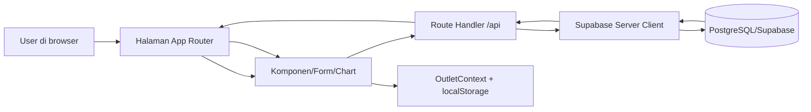
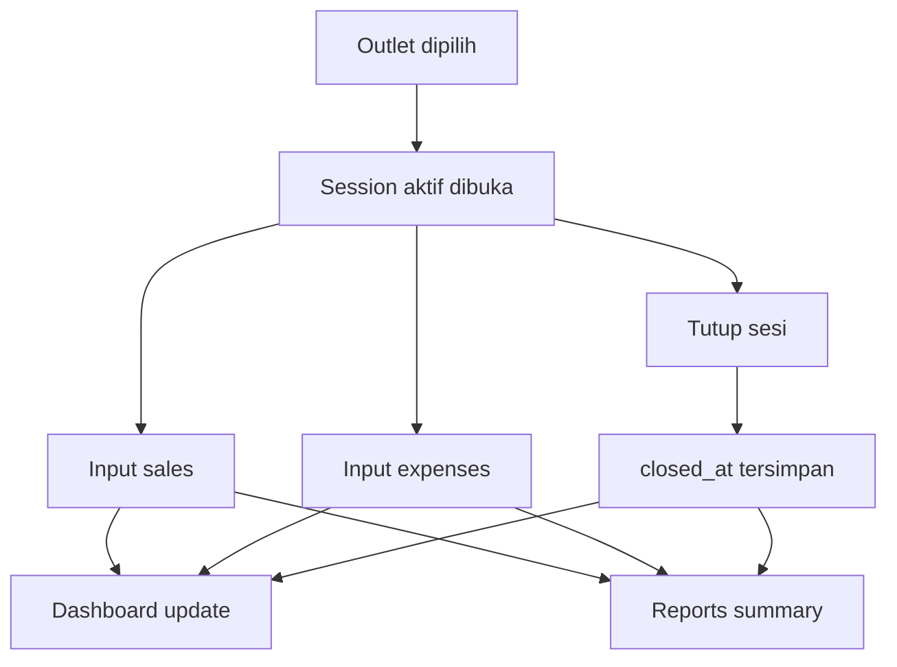
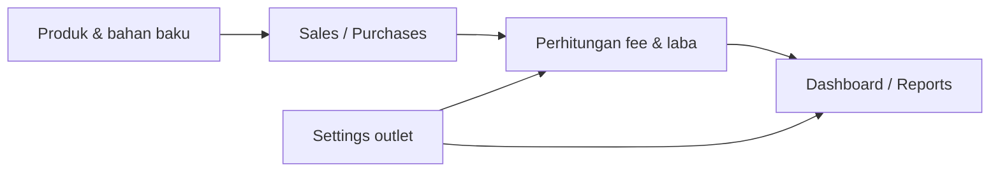
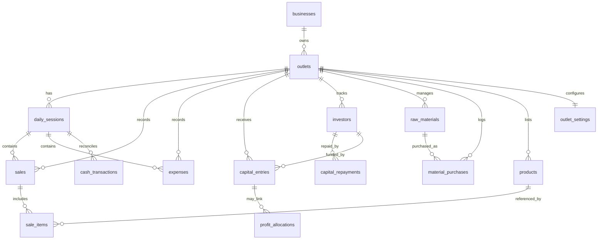

# Financial Management & Reporting System for Roti Bakar Usaha

Sistem manajemen keuangan dan pelaporan yang komprehensif untuk usaha roti bakar (makanan kaki lima Indonesia).

## Ringkasan Arsitektur

- **Framework**: Next.js App Router dengan route handler di `src/app/api/**`.
- **Data Layer**: Supabase PostgreSQL dengan akses server-side lewat `src/lib/supabase/server.ts`.
- **Multi-outlet**: Semua fitur inti mengikuti `outlet_id` aktif, bukan lagi fallback demo.
- **State Aplikasi**: Outlet aktif dipilih lewat `OutletContext` dan selector di header.
- **Prinsip Data**: Halaman sesi, dashboard, settings, investor, dan admin memakai data real dari API/DB.

## Perubahan Terbaru

- **Sesi Harian**: Detail sesi sekarang ambil data real, bukan mock; tombol tutup sesi memanggil `PATCH /api/sessions/{id}`.
- **Duplicate Guard**: `POST /api/sessions` menolak sesi open ganda untuk outlet yang sama.
- **Dashboard**: Perhitungan `net revenue`, `top products`, dan `weekly profit` sudah dibenarkan.
- **Outlet Context**: Hardcoded demo outlet dihapus dan diganti selector outlet dari API.
- **Settings**: Halaman pengaturan sekarang simpan dan baca data dari API/DB lewat `outlet_settings`.
- **Cleanup**: Beberapa fallback demo dan nilai dummy yang bisa mengubah data sudah dibersihkan.

## Rencana Ke Depan

- **Migration**: Jalankan `database/migration-session-status.sql` dan `database/migration-outlet-settings.sql` di Supabase.
- **Audit Lanjutan**: Cari sisa mock/dummy yang belum berdampak langsung ke laporan atau transaksi.
- **Multi-outlet Report**: Tambahkan ringkasan lintas outlet dan filter agregasi yang lebih jelas.
- **UX Mobile**: Rapikan selector outlet dan navigasi di layar kecil.
- **Security**: Ganti setup demo permissive ke RLS berbasis user/outlet untuk production.

## Peta Modul

- **`src/app/(auth)`**: Alur login dan layout autentikasi.
- **`src/app/(dashboard)`**: Halaman operasional utama seperti dashboard, sesi, sales, expenses, capital, products, reports, dan settings.
- **`src/app/api`**: Sumber data real untuk semua transaksi, ringkasan, dan aksi CRUD.
- **`src/components`**: Form, tabel, chart, header, sidebar, dan komponen UI reusable.
- **`src/lib`**: Kalkulasi bisnis, konteks outlet, helper kas, alokasi laba, ekspor Excel, dan client Supabase.
- **`database` + `migrations`**: Skema awal, perubahan struktur, dan seed SQL yang harus diselaraskan dengan kode.

## Alur Data



## Mapping Endpoint ke DB

| Endpoint | Tujuan | Tabel utama |
| --- | --- | --- |
| `/api/sessions` | List / create sesi | `daily_sessions` |
| `/api/sessions/[id]` | Close / delete sesi | `daily_sessions` |
| `/api/sales` | List / create penjualan | `sales`, `sale_items`, `products` |
| `/api/expenses` | List / create pengeluaran | `expenses` |
| `/api/capital` | List / create modal | `capital_entries` |
| `/api/investors` | CRUD investor | `investors`, `capital_repayments` |
| `/api/materials` | Master bahan baku | `raw_materials` |
| `/api/material-purchases` | Pembelian bahan | `material_purchases` |
| `/api/products` | Master produk | `products` |
| `/api/dashboard` | Ringkasan metrik | `sales`, `expenses`, `sale_items`, `daily_sessions` |
| `/api/reports/summary` | Laporan P&L | `sales`, `expenses`, `sale_items`, `daily_sessions` |
| `/api/settings` | Simpan pengaturan outlet | `outlet_settings` |
| `/api/outlets` | Daftar outlet aktif | `outlets`, `businesses` |

## Alur Fitur Utama





## Skema Inti

| Tabel | Peran | Relasi penting |
| --- | --- | --- |
| `businesses` | Identitas usaha | Induk dari `outlets` |
| `outlets` | Cabang/gerai aktif | Dipakai semua transaksi melalui `outlet_id` |
| `daily_sessions` | Wadah transaksi harian | Parent untuk `sales` dan `expenses` |
| `sales` | Header penjualan | Parent untuk `sale_items`, refer ke `daily_sessions` dan `outlets` |
| `sale_items` | Detail item penjualan | Refer ke `sales` dan `products` |
| `expenses` | Pengeluaran operasional | Refer ke `daily_sessions` dan `outlets` |
| `capital_entries` | Catatan modal masuk | Refer ke `outlets` dan opsional `investors` |
| `capital_repayments` | Riwayat pengembalian modal | Refer ke `investors` |
| `investors` | Data investor | Refer ke `outlets` |
| `raw_materials` | Master bahan baku | Refer ke `outlets` |
| `material_purchases` | Pembelian bahan | Refer ke `outlets` dan `raw_materials` |
| `products` | Master produk jualan | Refer ke `outlets` |
| `outlet_settings` | Konfigurasi per outlet | Unique per `outlet_id` |

## Diagram Relasi Tabel



## Daftar Endpoint Lengkap

### Operasional Inti

| Endpoint | Metode | Fungsi | Tabel utama |
| --- | --- | --- | --- |
| `/api/sessions` | `GET`, `POST` | Daftar dan buat sesi | `daily_sessions` |
| `/api/sessions/[id]` | `PATCH`, `DELETE` | Tutup atau hapus sesi | `daily_sessions` |
| `/api/sales` | `GET`, `POST` | Daftar dan buat penjualan | `sales`, `sale_items` |
| `/api/sales/[id]` | `PATCH`, `DELETE` | Edit atau hapus penjualan | `sales`, `sale_items` |
| `/api/expenses` | `GET`, `POST` | Daftar dan buat pengeluaran | `expenses` |
| `/api/expenses/[id]` | `PATCH`, `DELETE` | Edit atau hapus pengeluaran | `expenses` |
| `/api/capital` | `GET`, `POST` | Daftar dan buat modal | `capital_entries` |
| `/api/capital/[id]` | `PATCH`, `DELETE` | Edit atau hapus modal | `capital_entries` |
| `/api/dashboard` | `GET` | Ringkasan metrik utama | `sales`, `expenses`, `sale_items`, `daily_sessions` |
| `/api/reports/summary` | `GET` | Laporan P&L dan ringkasan | `sales`, `expenses`, `sale_items`, `daily_sessions` |
| `/api/reports/export` | `GET` | Export Excel laporan | gabungan query laporan |

### Produk, Bahan, dan Sourcing

| Endpoint | Metode | Fungsi | Tabel utama |
| --- | --- | --- | --- |
| `/api/products` | `GET`, `POST` | Master produk | `products` |
| `/api/products/[id]` | `PATCH`, `DELETE` | Edit atau hapus produk | `products` |
| `/api/raw-materials` | `GET`, `POST` | Master bahan baku | `raw_materials` |
| `/api/raw-materials/[id]` | `PATCH`, `DELETE` | Edit atau hapus bahan baku | `raw_materials` |
| `/api/material-purchases` | `GET`, `POST` | Catatan pembelian bahan | `material_purchases` |
| `/api/material-purchases/[id]` | `PATCH`, `DELETE` | Edit atau hapus pembelian bahan | `material_purchases` |
| `/api/materials/purchases` | `GET` | Alias riwayat pembelian bahan | `material_purchases` |
| `/api/suppliers` | `GET`, `POST` | Master supplier | `suppliers` |
| `/api/suppliers/[id]` | `PATCH`, `DELETE` | Edit atau hapus supplier | `suppliers` |
| `/api/supplier-prices` | `GET`, `POST` | Harga supplier / perbandingan | `supplier_prices` |

### Investor, Alokasi, dan Administrasi

| Endpoint | Metode | Fungsi | Tabel utama |
| --- | --- | --- | --- |
| `/api/investors` | `GET`, `POST` | Master investor | `investors` |
| `/api/investors/[id]` | `PATCH`, `DELETE` | Edit atau hapus investor | `investors` |
| `/api/capital-repayments` | `GET`, `POST` | Riwayat pengembalian modal | `capital_repayments` |
| `/api/capital-repayments/[id]` | `PATCH`, `DELETE` | Edit atau hapus repayment | `capital_repayments` |
| `/api/allocations` | `GET`, `POST` | Rekap alokasi laba | `profit_allocations` |
| `/api/allocations/[id]` | `PATCH`, `DELETE` | Edit atau hapus alokasi | `profit_allocations` |
| `/api/allocation-rules` | `GET`, `POST` | Aturan pembagian laba | `allocation_rules` |
| `/api/allocation-rules/[id]` | `PATCH`, `DELETE` | Edit atau hapus aturan | `allocation_rules` |
| `/api/profit-allocations` | `GET`, `POST` | Detail alokasi laba | `profit_allocations` |
| `/api/profit-allocations/[id]` | `PATCH`, `DELETE` | Edit atau hapus detail alokasi | `profit_allocations` |
| `/api/stakeholders` | `GET`, `POST` | Data stakeholder | `stakeholders` |
| `/api/stakeholders/[id]` | `PATCH`, `DELETE` | Edit atau hapus stakeholder | `stakeholders` |
| `/api/cash-transactions` | `GET`, `POST` | Mutasi kas | `cash_transactions` |
| `/api/cash-transactions/[id]` | `PATCH`, `DELETE` | Edit atau hapus mutasi kas | `cash_transactions` |
| `/api/admin/clear-data` | `POST` | Hapus data outlet terpilih | banyak tabel transaksi |

### Konfigurasi dan Referensi

| Endpoint | Metode | Fungsi | Tabel utama |
| --- | --- | --- | --- |
| `/api/settings` | `GET`, `PUT` | Baca/simpan setting outlet | `outlet_settings` |
| `/api/outlets` | `GET` | Daftar outlet aktif | `outlets`, `businesses` |

## 🎯 Fitur Utama

### Dashboard
- **Metrik Utama**: Pendapatan kotor, pendapatan bersih, keuntungan, dan pengeluaran
- **Visualisasi Data**: Grafik pendapatan per channel, metode pembayaran, trend keuntungan harian
- **Real-time Updates**: Data diperbarui otomatis

### Manajemen Sesi
- Buka sesi harian dengan modal awal
- Catat semua transaksi dalam sesi
- Tutup sesi dengan cash balance verification
- Riwayat sesi lengkap dengan detail penjualan dan pengeluaran

### Penjualan
- Input penjualan dengan tiga channel: Offline, ShopeeFood, GoFood
- Kalkulasi otomatis biaya platform (0% offline, 20% ShopeeFood, 25% GoFood)
- Support metode pembayaran: Cash & QRIS
- Pencatatan catatan per transaksi

### Pengeluaran
- Kategori pengeluaran: Bahan Baku, Operasional, Transport, Peralatan, Lain-lain
- Pencatatan tanggal, kategori, deskripsi, dan jumlah
- Analisis pengeluaran per kategori

### Modal Usaha
- Pencatatan entri modal dari berbagai sumber
- Total modal terakumulasi
- Riwayat lengkap dengan tanggal dan sumber

### Manajemen Investor
- **Daftar Investor**: Track semua pemberi modal dengan prioritas pengembalian
- **Sistem Return Modal**: Pencatatan pengembalian modal dengan otomatis update saldo
- **Progress Tracking**: Progress pengembalian per investor dengan persentase
- **History**: Riwayat lengkap pengembalian modal untuk setiap investor
- **Priority-based Repayment**: Investor dengan priority lebih tinggi didahulukan pengembaliannya

### Alokasi Laba & Kas Muter
- Catat laba bulanan setelah operasional berjalan
- Pisahkan dana yang ditahan sebagai kas muter / cadangan
- Pisahkan dana yang dibagikan ke founder / partner / bonus tim
- Simpan skema alokasi yang fleksibel per bulan
- Cocok untuk fase balik modal, fase normal, dan fase ekspansi

### Pembelian Bahan Baku
- Input pembelian dengan kalkulasi otomatis total (qty × unit price)
- Pencatatan tanggal, jumlah, dan harga per unit
- Riwayat pembelian lengkap

### Produk
- Manajemen daftar produk dengan harga
- Status aktif/nonaktif produk
- Deskripsi dan detail produk

### Laporan Keuangan
- **Laporan P&L**: Pendapatan kotor, biaya platform, pendapatan bersih, pengeluaran, laba
- **Marjin Keuntungan**: Persentase profit margin
- **Analisis per Kategori**: Breakdown pengeluaran per kategori
- **Export Excel**: Multi-sheet dengan summary dan detail
- **Filter Periode**: Laporan berdasarkan range tanggal

## 🔄 Alur Operasional yang Disarankan

1. **Buka Sesi Harian**
  - Buat sesi harian dulu sebagai wadah semua transaksi hari itu.
  - Semua penjualan dan pengeluaran harus menempel ke sesi aktif.

2. **Input Penjualan**
  - Catat transaksi terjual dari buku manual atau rekap Damim.
  - Channel menentukan fee platform otomatis.

3. **Input Pengeluaran Operasional**
  - Gunakan untuk bensin, plastik, tisu, listrik, parkir, dan biaya harian lain.
  - Ini bukan pembelian stok bahan.

4. **Input Pembelian Bahan**
  - Gunakan fitur sourcing untuk bahan baku, supplier, dan pembelian stok.
  - Data ini dipisah dari pengeluaran operasional supaya stok dan biaya tidak tercampur.

5. **Input Modal / Investor**
  - Catat modal awal, tambahan modal, dan pembayaran kembali modal.
  - Fase awal bisa fokus ke balik modal dulu.

6. **Catat Alokasi Laba Bulanan**
  - Setelah balik modal atau sesuai keputusan bulanan, tentukan berapa yang ditahan di kas muter dan berapa yang dibagi.
  - Skema bisa berubah tiap bulan sesuai kebutuhan usaha.

7. **Cek Dashboard & Laporan**
  - Dashboard untuk pantau ringkasan harian.
  - Laporan untuk lihat profit, biaya, dan posisi usaha.

## 🛠️ Tech Stack

- **Frontend**: Next.js 16.2.6 (App Router + Turbopack)
- **UI Library**: React 19.2.4
- **Styling**: Tailwind CSS v4 (@tailwindcss/postcss)
- **Components**: shadcn/ui
- **Database**: Supabase PostgreSQL
- **Authentication**: Supabase Auth
- **Charts**: Recharts
- **Excel Export**: SheetJS (xlsx)
- **Icons**: lucide-react
- **Date Utilities**: date-fns

## 📋 Prerequisites

- Node.js 18+ dan npm/yarn
- Akun Supabase (gratis: https://supabase.com)
- Browser modern

## 🚀 Setup & Installation

### 1. Clone Repository
```bash
git clone <repo-url>
cd roti-bakar-finance
```

### 2. Install Dependencies
```bash
npm install
```

### 3. Setup Supabase

#### Buat Project Baru
1. Kunjungi https://supabase.com
2. Sign up atau login
3. Buat project baru
4. Tunggu project selesai

#### Setup Database Schema
1. Di Supabase, buka **SQL Editor**
2. Klik **New Query**
3. Copy-paste script SQL di bawah
4. Klik **Run**
5. ✅ Database siap dengan seed awal untuk outlet, produk, sesi, dan laporan contoh

#### Jalankan Migration Tambahan

Setelah schema utama, jalankan juga file ini agar struktur terbaru sesuai kode:

- `database/migration-session-status.sql` → menambah `closed_at` pada sesi
- `database/migration-outlet-settings.sql` → membuat tabel `outlet_settings`

**Atau untuk investor system saja:**
- File: `database/investor-schema.sql` di root project
- Copy-paste ke Supabase SQL Editor dan Run

#### Ambil API Keys
1. Di Supabase dashboard, klik **Settings** (gear icon)
2. Pilih **API** di sidebar kiri
3. Salin:
   - `Project URL` → `NEXT_PUBLIC_SUPABASE_URL`
   - `anon public` → `NEXT_PUBLIC_SUPABASE_ANON_KEY`
   - `service_role secret` → `SUPABASE_SERVICE_ROLE_KEY` (optional untuk demo)
```sql
-- ========================================
-- DEMO SETUP: All tables with permissive RLS
-- ========================================

-- Businesses table
CREATE TABLE IF NOT EXISTS businesses (
  id UUID PRIMARY KEY DEFAULT uuid_generate_v4(),
  name VARCHAR(255) NOT NULL,
  owner_name VARCHAR(255),
  email VARCHAR(255) NOT NULL,
  phone VARCHAR(20),
  address TEXT,
  created_at TIMESTAMP DEFAULT NOW(),
  updated_at TIMESTAMP DEFAULT NOW()
);

-- Outlets table
CREATE TABLE IF NOT EXISTS outlets (
  id UUID PRIMARY KEY DEFAULT uuid_generate_v4(),
  business_id UUID NOT NULL REFERENCES businesses(id) ON DELETE CASCADE,
  name VARCHAR(255) NOT NULL,
  location VARCHAR(255),
  opening_hours VARCHAR(100),
  created_at TIMESTAMP DEFAULT NOW()
);

-- Products table
CREATE TABLE IF NOT EXISTS products (
  id UUID PRIMARY KEY DEFAULT uuid_generate_v4(),
  outlet_id UUID NOT NULL REFERENCES outlets(id) ON DELETE CASCADE,
  name VARCHAR(255) NOT NULL,
  price DECIMAL(10, 2) NOT NULL,
  description TEXT,
  is_active BOOLEAN DEFAULT true,
  created_at TIMESTAMP DEFAULT NOW()
);

-- Raw materials table
CREATE TABLE IF NOT EXISTS raw_materials (
  id UUID PRIMARY KEY DEFAULT uuid_generate_v4(),
  outlet_id UUID NOT NULL REFERENCES outlets(id) ON DELETE CASCADE,
  name VARCHAR(255) NOT NULL,
  unit VARCHAR(50),
  current_stock DECIMAL(10, 2) DEFAULT 0,
  reorder_level DECIMAL(10, 2),
  created_at TIMESTAMP DEFAULT NOW()
);

-- Investors table (untuk tracking pemberi modal)
CREATE TABLE IF NOT EXISTS investors (
  id UUID PRIMARY KEY DEFAULT uuid_generate_v4(),
  outlet_id UUID NOT NULL REFERENCES outlets(id) ON DELETE CASCADE,
  name VARCHAR(255) NOT NULL,
  phone VARCHAR(20),
  initial_contribution DECIMAL(15, 2) NOT NULL,
  remaining_balance DECIMAL(15, 2) NOT NULL,
  status VARCHAR(50) DEFAULT 'active',
  priority_order INT,
  created_at TIMESTAMP DEFAULT NOW()
);

-- Capital entries table (modified untuk link ke investor)
CREATE TABLE IF NOT EXISTS capital_entries (
  id UUID PRIMARY KEY DEFAULT uuid_generate_v4(),
  outlet_id UUID NOT NULL REFERENCES outlets(id) ON DELETE CASCADE,
  date DATE NOT NULL,
  amount DECIMAL(15, 2) NOT NULL,
  source VARCHAR(255),
  source_type VARCHAR(50),
  investor_id UUID REFERENCES investors(id) ON DELETE SET NULL,
  notes TEXT,
  created_at TIMESTAMP DEFAULT NOW()
);

-- Capital repayments table (track pengembalian modal)
CREATE TABLE IF NOT EXISTS capital_repayments (
  id UUID PRIMARY KEY DEFAULT uuid_generate_v4(),
  investor_id UUID NOT NULL REFERENCES investors(id) ON DELETE CASCADE,
  amount DECIMAL(15, 2) NOT NULL,
  repayment_date DATE NOT NULL,
  method VARCHAR(50),
  notes TEXT,
  created_at TIMESTAMP DEFAULT NOW()
);

-- Daily sessions table
CREATE TABLE IF NOT EXISTS daily_sessions (
  id UUID PRIMARY KEY DEFAULT uuid_generate_v4(),
  outlet_id UUID NOT NULL REFERENCES outlets(id) ON DELETE CASCADE,
  date DATE NOT NULL,
  opening_cash DECIMAL(15, 2) NOT NULL,
  closing_cash DECIMAL(15, 2),
  status VARCHAR(20) DEFAULT 'open',
  notes TEXT,
  created_at TIMESTAMP DEFAULT NOW()
);

-- Sales table
CREATE TABLE IF NOT EXISTS sales (
  id UUID PRIMARY KEY DEFAULT uuid_generate_v4(),
  session_id UUID NOT NULL REFERENCES daily_sessions(id) ON DELETE CASCADE,
  outlet_id UUID NOT NULL REFERENCES outlets(id) ON DELETE CASCADE,
  date DATE DEFAULT NOW(),
  channel VARCHAR(50) NOT NULL,
  payment_method VARCHAR(50) NOT NULL,
  gross_amount DECIMAL(15, 2) NOT NULL,
  platform_fee DECIMAL(15, 2) DEFAULT 0,
  net_amount DECIMAL(15, 2) NOT NULL,
  order_ref VARCHAR(100),
  notes TEXT,
  created_at TIMESTAMP DEFAULT NOW()
);

-- Sale items table
CREATE TABLE IF NOT EXISTS sale_items (
  id UUID PRIMARY KEY DEFAULT uuid_generate_v4(),
  sale_id UUID NOT NULL REFERENCES sales(id) ON DELETE CASCADE,
  product_id UUID REFERENCES products(id) ON DELETE SET NULL,
  quantity DECIMAL(10, 2) NOT NULL,
  unit_price DECIMAL(15, 2) NOT NULL,
  subtotal DECIMAL(15, 2) NOT NULL,
  created_at TIMESTAMP DEFAULT NOW()
);

-- Expenses table
CREATE TABLE IF NOT EXISTS expenses (
  id UUID PRIMARY KEY DEFAULT uuid_generate_v4(),
  session_id UUID NOT NULL REFERENCES daily_sessions(id) ON DELETE CASCADE,
  outlet_id UUID NOT NULL REFERENCES outlets(id) ON DELETE CASCADE,
  date DATE NOT NULL,
  category VARCHAR(50) NOT NULL,
  description VARCHAR(255) NOT NULL,
  amount DECIMAL(15, 2) NOT NULL,
  notes TEXT,
  created_at TIMESTAMP DEFAULT NOW()
);

-- Material purchases table
CREATE TABLE IF NOT EXISTS material_purchases (
  id UUID PRIMARY KEY DEFAULT uuid_generate_v4(),
  outlet_id UUID NOT NULL REFERENCES outlets(id) ON DELETE CASCADE,
  raw_material_id UUID REFERENCES raw_materials(id) ON DELETE SET NULL,
  date DATE NOT NULL,
  quantity DECIMAL(10, 2) NOT NULL,
  unit_price DECIMAL(15, 2) NOT NULL,
  total_amount DECIMAL(15, 2) NOT NULL,
  notes TEXT,
  created_at TIMESTAMP DEFAULT NOW()
);

-- ========================================
-- ENABLE RLS (DEMO MODE - ALL PERMISSIVE)
-- ========================================
ALTER TABLE businesses ENABLE ROW LEVEL SECURITY;
ALTER TABLE outlets ENABLE ROW LEVEL SECURITY;
ALTER TABLE products ENABLE ROW LEVEL SECURITY;
ALTER TABLE raw_materials ENABLE ROW LEVEL SECURITY;
ALTER TABLE investors ENABLE ROW LEVEL SECURITY;
ALTER TABLE capital_entries ENABLE ROW LEVEL SECURITY;
ALTER TABLE capital_repayments ENABLE ROW LEVEL SECURITY;
ALTER TABLE daily_sessions ENABLE ROW LEVEL SECURITY;
ALTER TABLE sales ENABLE ROW LEVEL SECURITY;
ALTER TABLE sale_items ENABLE ROW LEVEL SECURITY;
ALTER TABLE expenses ENABLE ROW LEVEL SECURITY;
ALTER TABLE material_purchases ENABLE ROW LEVEL SECURITY;

-- Permissive policies for demo
CREATE POLICY "businesses_all" ON businesses FOR ALL USING (true);
CREATE POLICY "outlets_all" ON outlets FOR ALL USING (true);
CREATE POLICY "products_all" ON products FOR ALL USING (true);
CREATE POLICY "raw_materials_all" ON raw_materials FOR ALL USING (true);
CREATE POLICY "investors_all" ON investors FOR ALL USING (true);
CREATE POLICY "capital_entries_all" ON capital_entries FOR ALL USING (true);
CREATE POLICY "capital_repayments_all" ON capital_repayments FOR ALL USING (true);
CREATE POLICY "daily_sessions_all" ON daily_sessions FOR ALL USING (true);
CREATE POLICY "sales_all" ON sales FOR ALL USING (true);
CREATE POLICY "sale_items_all" ON sale_items FOR ALL USING (true);
CREATE POLICY "expenses_all" ON expenses FOR ALL USING (true);
CREATE POLICY "material_purchases_all" ON material_purchases FOR ALL USING (true);

-- ========================================
-- INSERT DEMO DATA
-- ========================================
INSERT INTO businesses (id, name, owner_name, email, phone, address)
VALUES ('550e8400-e29b-41d4-a716-446655440000', 'Roti Bakar Saya', 'Pemilik', 'owner@example.com', '0812-3456-7890', 'Jl. Contoh No. 123');

INSERT INTO outlets (id, business_id, name, location)
VALUES ('660e8400-e29b-41d4-a716-446655440000', '550e8400-e29b-41d4-a716-446655440000', 'Outlet Utama', 'Jl. Contoh No. 123');

INSERT INTO products (id, outlet_id, name, price, description)
VALUES 
  ('550e8400-e29b-41d4-a716-446655440001', '660e8400-e29b-41d4-a716-446655440000', 'Roti Bakar Standar', 5000, 'Roti bakar dengan topping standar'),
  ('550e8400-e29b-41d4-a716-446655440002', '660e8400-e29b-41d4-a716-446655440000', 'Roti Bakar Premium', 10000, 'Roti bakar dengan topping premium');

INSERT INTO capital_entries (outlet_id, date, amount, source, source_type)
VALUES ('660e8400-e29b-41d4-a716-446655440000', '2026-05-25', 5000000, 'Modal awal', 'owner');

-- Investor data
INSERT INTO investors (id, outlet_id, name, phone, initial_contribution, remaining_balance, status, priority_order)
VALUES 
  ('ee0e8400-e29b-41d4-a716-446655440000', '660e8400-e29b-41d4-a716-446655440000', 'Teman A', '0812-1111-1111', 2000000, 1700000, 'active', 1),
  ('ff0e8400-e29b-41d4-a716-446655440000', '660e8400-e29b-41d4-a716-446655440000', 'Teman B', '0812-2222-2222', 1000000, 950000, 'active', 2);

-- Capital repayment history
INSERT INTO capital_repayments (investor_id, amount, repayment_date, method)
VALUES 
  ('ee0e8400-e29b-41d4-a716-446655440000', 300000, '2026-05-24', 'cash'),
  ('ff0e8400-e29b-41d4-a716-446655440000', 50000, '2026-05-25', 'cash');

INSERT INTO daily_sessions (id, outlet_id, date, opening_cash, status)
VALUES 
  ('770e8400-e29b-41d4-a716-446655440000', '660e8400-e29b-41d4-a716-446655440000', '2026-05-25', 500000, 'open'),
  ('880e8400-e29b-41d4-a716-446655440000', '660e8400-e29b-41d4-a716-446655440000', '2026-05-24', 400000, 'closed');

INSERT INTO sales (id, session_id, outlet_id, date, channel, payment_method, gross_amount, platform_fee, net_amount)
VALUES 
  ('990e8400-e29b-41d4-a716-446655440000', '770e8400-e29b-41d4-a716-446655440000', '660e8400-e29b-41d4-a716-446655440000', '2026-05-26', 'offline', 'cash', 100000, 0, 100000),
  ('aa0e8400-e29b-41d4-a716-446655440000', '770e8400-e29b-41d4-a716-446655440000', '660e8400-e29b-41d4-a716-446655440000', '2026-05-26', 'shopeefood', 'qris', 150000, 30000, 120000);

INSERT INTO sale_items (id, sale_id, product_id, quantity, unit_price, subtotal)
VALUES 
  ('bb0e8400-e29b-41d4-a716-446655440000', '990e8400-e29b-41d4-a716-446655440000', '550e8400-e29b-41d4-a716-446655440001', 10, 10000, 100000),
  ('cc0e8400-e29b-41d4-a716-446655440000', 'aa0e8400-e29b-41d4-a716-446655440000', '550e8400-e29b-41d4-a716-446655440001', 15, 10000, 150000);

INSERT INTO expenses (id, outlet_id, session_id, date, category, description, amount)
VALUES ('dd0e8400-e29b-41d4-a716-446655440000', '660e8400-e29b-41d4-a716-446655440000', '770e8400-e29b-41d4-a716-446655440000', '2026-05-25', 'operasional', 'Biaya listrik', 50000);

```

### 4. Setup Environment Variables
1. Buka file `.env.local` di root project
2. Isi dengan nilai dari Supabase:
```
NEXT_PUBLIC_SUPABASE_URL=https://xxxxx.supabase.co
NEXT_PUBLIC_SUPABASE_ANON_KEY=eyJxxxxx...
SUPABASE_SERVICE_ROLE_KEY=eyJxxxxx...
```

### 5. Jalankan Development Server
```bash
npm run dev
```

Akses aplikasi di: http://localhost:3000

**✅ Demo data sudah auto-loaded!** Semua fitur bisa langsung ditest, tidak perlu login.

## 📱 Cara Menggunakan

### Setup Pertama (Demo Mode)
1. Akses http://localhost:3000
2. Semua data awal tersedia dari seed database (1 outlet, produk, sesi, dll)
3. Mulai input data penjualan, pengeluaran, dll

### Catatan Arsitektur Data

- Data transaksi selalu mengikuti outlet aktif yang dipilih.
- Dashboard, laporan, dan detail sesi membaca data real dari API.
- Settings disimpan per outlet agar setiap cabang bisa punya konfigurasi sendiri.
- Jika tabel baru belum ada di Supabase, beberapa endpoint memberi fallback aman supaya aplikasi tetap jalan.

### Workflow Harian (setelah Supabase terhubung)
1. **Buka Sesi**: Dashboard → Sesi Harian → Input modal awal
2. **Input Penjualan**: Dashboard → Penjualan → Isi form (auto-kalkulasi fee platform)
3. **Input Pengeluaran**: Dashboard → Pengeluaran → Isi form (pilih kategori)
4. **Tutup Sesi**: Dashboard → Sesi → Tutup sesi → Verifikasi cash balance
5. **Lihat Laporan**: Dashboard → Laporan → Pilih periode → Export Excel (opsional)

### Menu Navigasi
- **Dashboard**: Overview dan metrics
- **Sesi Harian**: Manajemen sesi
- **Penjualan**: Input dan history penjualan
- **Pengeluaran**: Input dan tracking pengeluaran
- **Modal**: Pencatatan modal usaha
- **Investor**: Manajemen investor dan tracking pengembalian modal
- **Bahan Baku**: Manajemen pembelian bahan
- **Produk**: Daftar produk dan harga
- **Laporan**: P&L dan export Excel
- **Pengaturan**: Informasi usaha dan akun

## 📊 Format Data

### Currency Format
Semua nilai ditampilkan dalam format Rupiah dengan separator titik:
- `Rp 1.000.000` bukan `Rp 1000000`

### Date Format
Tanggal ditampilkan dalam format: `DD MMM YYYY`
- `22 Mei 2024`

### Platform Fees
- **Offline**: 0%
- **ShopeeFood**: 20%
- **GoFood**: 25%

## 🔐 Security Notes

⚠️ **IMPORTANT**: Setup awal masih mengutamakan kemudahan testing; untuk production, RLS harus dibuat lebih ketat.

Production setup harus:
- ✅ Enable authentication (Supabase Auth)
- ✅ Implement user_id based RLS policies
- ✅ Add row-level access control
- ✅ Jangan share `SUPABASE_SERVICE_ROLE_KEY`
- ✅ Jangan commit file `.env.local` (sudah di `.gitignore`)

## 🛠️ Troubleshooting

### "Connection refused" atau error saat query
- Periksa URL Supabase di `.env.local`
- Pastikan project aktif di Supabase dashboard
- Pastikan schema SQL sudah dijalankan

### Data tidak muncul di tabel (setelah Supabase connected)
- Periksa browser console untuk error
- Pastikan Supabase API keys benar
- Try reload page (Ctrl+R)

### Build error atau npm error
```bash
npm install
npm run dev
```

### Dev server port 3000 sudah digunakan
```bash
# Kill existing process (Windows)
taskkill /PID <process_id> /F

# Or use different port
PORT=3001 npm run dev
```

## 📚 Project Structure

```
src/
├── app/
│   ├── (auth)/
│   │   └── login/page.tsx          # Login page
│   ├── (dashboard)/
│   │   ├── layout.tsx               # Dashboard shell + outlet context
│   │   ├── dashboard/page.tsx        # Ringkasan metrik dan chart
│   │   ├── sales/page.tsx            # Input dan riwayat penjualan
│   │   ├── expenses/page.tsx         # Input dan riwayat pengeluaran
│   │   ├── capital/page.tsx          # Pencatatan modal
│   │   ├── materials/page.tsx        # Pembelian bahan baku
│   │   ├── products/page.tsx         # Master produk dan harga
│   │   ├── reports/page.tsx          # Laporan P&L dan export
│   │   ├── sessions/page.tsx         # Daftar sesi harian
│   │   └── sessions/[id]/page.tsx    # Detail sesi, sales, expenses
│   ├── api/
│   │   ├── sessions/route.ts         # List/create session + duplicate guard
│   │   ├── sessions/[id]/route.ts    # Close/delete session
│   │   ├── sales/route.ts            # Sales API
│   │   ├── expenses/route.ts         # Expenses API
│   │   ├── capital/route.ts          # Capital API
│   │   ├── materials/route.ts        # Materials API
│   │   ├── products/route.ts         # Products API
│   │   ├── dashboard/route.ts        # Dashboard metrics API
│   │   ├── outlets/route.ts          # Daftar outlet aktif
│   │   ├── settings/route.ts         # Setting per outlet
│   │   └── reports/
│   │       ├── summary/route.ts      # P&L report API
│   │       └── export/route.ts       # Excel export API
│   └── middleware.ts                 # Auth middleware
├── components/
│   ├── forms/
│   │   ├── SessionForm.tsx
│   │   ├── SaleForm.tsx
│   │   ├── ExpenseForm.tsx
│   │   ├── CapitalForm.tsx
│   │   └── MaterialPurchaseForm.tsx
│   ├── charts/
│   │   ├── RevenueByChannelChart.tsx
│   │   ├── PaymentMethodChart.tsx
│   │   ├── DailyProfitChart.tsx
│   │   └── TopProductsChart.tsx
│   ├── tables/
│   │   ├── SalesTable.tsx
│   │   ├── ExpensesTable.tsx
│   │   └── ReportsTable.tsx
│   ├── layout/
│   │   ├── Sidebar.tsx
│   │   └── Header.tsx
│   └── ui/
│       └── [shadcn components]
├── lib/
│   ├── supabase/
│   │   ├── client.ts                 # Browser Supabase client
│   │   └── server.ts                 # Server Supabase client
│   ├── context/
│   │   └── OutletContext.tsx         # Outlet aktif + session aktif
│   ├── calculations/
│   │   ├── platform-fees.ts          # Fee calculations
│   │   └── profit.ts                 # Profit calculations
│   ├── allocation/
│   │   └── engine.ts                 # Engine alokasi laba
│   ├── cash/
│   │   └── ledger.ts                 # Catatan kas
│   ├── export/
│   │   └── excel.ts                  # Excel export utility
│   └── utils.ts                      # Helper umum
├── database/
│   ├── investor-schema.sql            # Skema investor dan seed dasar
│   ├── migration-session-status.sql   # Tambah closed_at pada sesi
│   └── migration-outlet-settings.sql  # Tabel settings per outlet
├── migrations/
│   └── *.sql                          # Script perubahan schema/seed
└── types/
    └── index.ts                      # TypeScript types
```

## Status Implementasi

- **Sudah beres**: session open/close/delete, duplicate prevention, dashboard calculation, outlet selector, settings persistence.
- **Sedang dijaga**: penghapusan fallback demo dan hardcoded outlet agar tidak ada write ke outlet salah.
- **Perlu dikerjakan**: migrasi DB di environment produksi dan penyempurnaan laporan multi-outlet.

## 🚢 Deployment

### Deploy ke Vercel (Recommended)
1. Push code ke GitHub
2. Kunjungi https://vercel.com
3. Import repository
4. Atur environment variables
5. Deploy

### Deploy ke Netlify
1. Push code ke GitHub
2. Kunjungi https://netlify.com
3. Connect repository
4. Atur environment variables
5. Deploy

## 📝 License

MIT - Bebas digunakan untuk keperluan komersial dan pribadi

## 👨‍💻 Support

Untuk bantuan, hubungi melalui:
- Email: support@example.com
- Issues: GitHub issues
- Dokumentasi: Lihat wiki project

---

**Last Updated**: 29 Mei 2026
**Version**: 1.0.0
